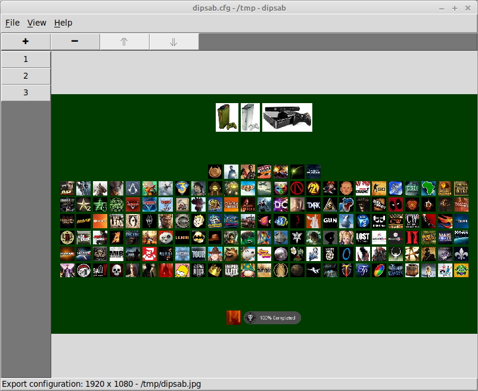

dipsab
======

dipsab is the acronym for Directory Images Padded, Stacked And Bordered, a
program for the interactive creation of desktop images composed of directories
worth of images.

Features
--------

* Works on Python 3.6+
* Saves configurations to user-named files.
* Exports an image in JPEG format.

Limitations
-----------
* Currently does not resize directory images.
* Untested for most uses.
* No error reporting for directories not found when loading a configuration.

